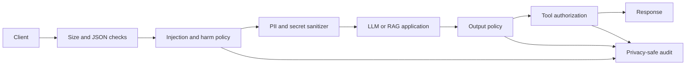

# Production AI Guardrails Platform

A provider-neutral enforcement layer for chat, RAG, agents, and tool-using AI systems. It evaluates both sides of a JSON API, sanitizes sensitive data, blocks high-risk content, authorizes tool calls, and creates privacy-safe evidence for security operations.

This is a deterministic first line of defense—not a claim that one classifier can make an AI system safe. Production safety also requires model-provider controls, least-privilege identities, human approval for consequential actions, continuous red-team evaluation, and incident response.

## Control coverage

| Boundary | Controls |
|---|---|
| Input | Prompt injection and jailbreak patterns, harmful instructions, secrets, request-size limit, strict JSON parsing |
| Privacy | Email, phone, Canadian postal code and SIN, US SSN, Luhn-valid payment cards; recursive structured redaction |
| Output | PII and secret redaction, harmful-output blocking, stable safe errors |
| Agents | Tool allowlist, human approval for mutations, URL/SSRF protection |
| Operations | Block or monitor rollout modes, versioned policy headers, request correlation, HMAC fingerprints, structured audits |
| Delivery | Non-root container, locked dependency ranges, CI tests and image build, health/readiness endpoints |

## Request flow



## Quick start

```bash
python -m venv .venv
source .venv/bin/activate
pip install -e '.[dev]'
pytest -q
python -m guardrails.evaluate --minimum-score 1.0
GUARDRAIL_AUDIT_KEY='replace-with-secret-manager-value' uvicorn app:app --reload
```

Protect any FastAPI/Starlette application:

```python
from guardrails import GuardrailMiddleware

app.add_middleware(GuardrailMiddleware, mode="block")
```

Authorize a proposed agent action separately from natural-language scanning:

```python
from guardrails import ToolPolicy

tools = ToolPolicy({"search_catalog", "issue_refund"}, {"issue_refund"})
decision = tools.authorize("issue_refund", {"order_id": "123"}, approved=False)
assert decision.reason == "human_approval_required"
```

## Production rollout

1. Deploy in `monitor` mode and review false positives without retaining raw prompts.
2. Pin a policy version and run the adversarial regression suite.
3. Enable `block` for high-confidence input categories.
4. Keep tool authorization outside the model and require approval for mutations.
5. Alert on rejection-rate changes, audit failures, and policy-version drift.
6. Roll back the policy version independently of the application.

See [Threat model](docs/THREAT_MODEL.md), [Operations runbook](docs/RUNBOOK.md), and [Production architecture](docs/ARCHITECTURE.md).

## Explicit limitations

- Regex rules do not replace semantic classifiers such as Llama Guard, Bedrock Guardrails, or a separately deployed moderation model.
- Encoded, multilingual, image, audio, and deeply obfuscated attacks need modality-specific classifiers and normalization.
- Streaming tokens require a chunk/window scanner before forwarding; this middleware deliberately buffers JSON responses and should not be attached to SSE routes.
- RAG systems must additionally validate document provenance, permissions, retrieval scope, and citations.
- Detection is never authorization. A model must not directly control credentials or consequential tools.

The public API is deliberately provider neutral so semantic detectors can be added behind the same policy and audit contract.
